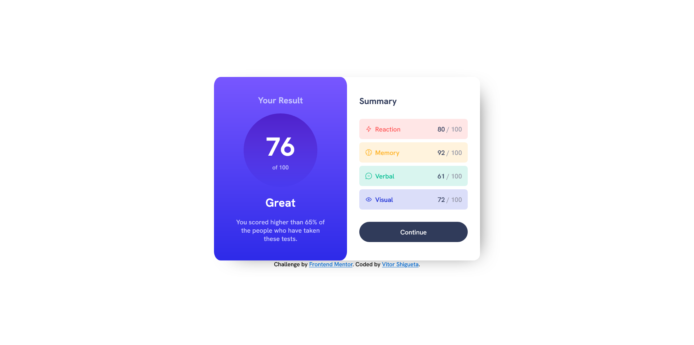

# Frontend Mentor - Results summary component solution

This is a solution to the [Results summary component challenge on Frontend Mentor](https://www.frontendmentor.io/challenges/results-summary-component-CE_K6s0maV). Frontend Mentor challenges help you improve your coding skills by building realistic projects. 

## Table of contents

- [Overview](#overview)
  - [The challenge](#the-challenge)
  - [Screenshot](#screenshot)
  - [Links](#links)
- [My process](#my-process)
  - [Built with](#built-with)
  - [What I learned](#what-i-learned)
  - [Useful resources](#useful-resources)
- [Author](#author)

## Overview

### The challenge

Users should be able to:

- View the optimal layout for the interface depending on their device's screen size
- See hover and focus states for all interactive elements on the page

### Screenshot

### Links

- Solution URL: [GitHub](https://github.com/VitorShigueta/result-summary-component)
- Live Site URL: [Site](https://thunderous-khapse-511581.netlify.app/)

## My process

### Built with

- Semantic HTML5 markup
- CSS custom properties
- Flexbox
- JavaScript

### What I learned

I learned how to use the transparency property to get the range of colors I might need and effects like making something fade out.

### Useful resources

- [CSS Gradient](https://cssgradient.io/) - This helped me create the necessary gradients.
- [Converting Colors](https://convertingcolors.com/) - This helped me to find the colors in their different formats

## Author

- Frontend Mentor - [@VitorShigueta](https://www.frontendmentor.io/profile/VitorShigueta)